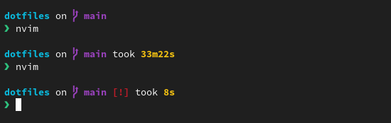
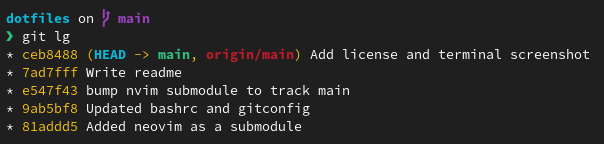

# Blyedev's dotfiles

These are config files to set up the MacOS terminal the way I like using it.

Formerly I have used this config for Arch Linux, if you're looking for os specific configurations I recommend you check out the history of the project.

The standout feature of this repository is the Neovim configuration which is actually not under version control here but included as a [Git submodule](https://git-scm.com/book/en/v2/Git-Tools-Submodules). Keeping Neovim's config separate allows me to keep better track of it's history, while still allowing me to have everything sort of in one place.

## Installation

**Prerequisites:**

- [GNU Stow](https://www.gnu.org/software/stow/) installed
- [Git](https://git-scm.com/) installed

**Run**:

```sh
git clone --recurse-submodules https://github.com/blyedev/dotfiles ~/dotfiles
cd ~/dotfiles
stow .
```

## Features

- **Custom Bash Prompt:** Powered by [Starship](https://starship.rs/).



- **Git Enhancements:** I prefer using the terminal for Git operations, this alias of git log makes that much easier:



That's pretty much it. Check out my [neovim config](https://github.com/blyedev/nvim-config) for the cooler stuff

## Why Are Dotfiles?

Dotfiles are configuration files that define how our systems behave and look. As Unix users, we make our machines our own by tailoring these configurations to our unique preferences and workflows. In return, we gain valuable productivity and efficiency. Most importantly, it's simply fun. There's nothing better than having your terminal greet you by name.

By sharing our dotfiles, we exchange a little part of us with others, making their lives easier. So share your dotfiles so I can honor the age old tradition of plundering yours. Also, read this great [article](https://zachholman.com/2010/08/dotfiles-are-meant-to-be-forked/) by Zach Holman.
